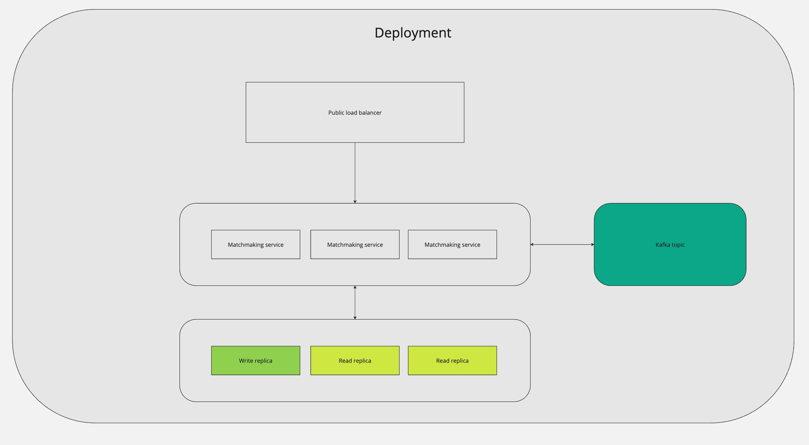
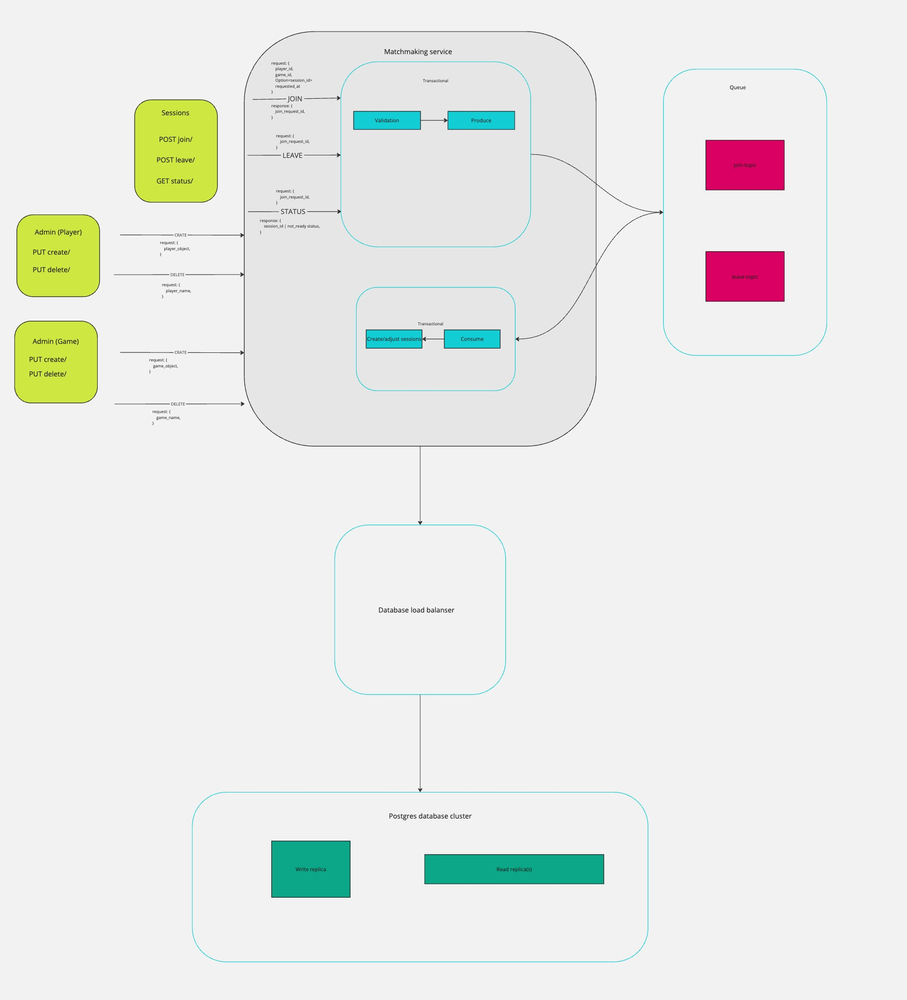

## Overall design

[Source](https://miro.com/app/board/uXjVKnZ4T5Q=/?share_link_id=29326324376)

### High level design

### Matchmaking service design

## How to run

All commands are meant to be run from the project root.

## Dev version

* Run `docker compose -f docker-compose-dev.yml  up -d` to spin off a single node postgres DB
* Run the MatchMaking project
    * Either from your IDEA
    * Or run `dotnet run --project MatchMaking` from your shell 

## Prod version

* Run `docker compose --env-file prod-sample.env up -d`